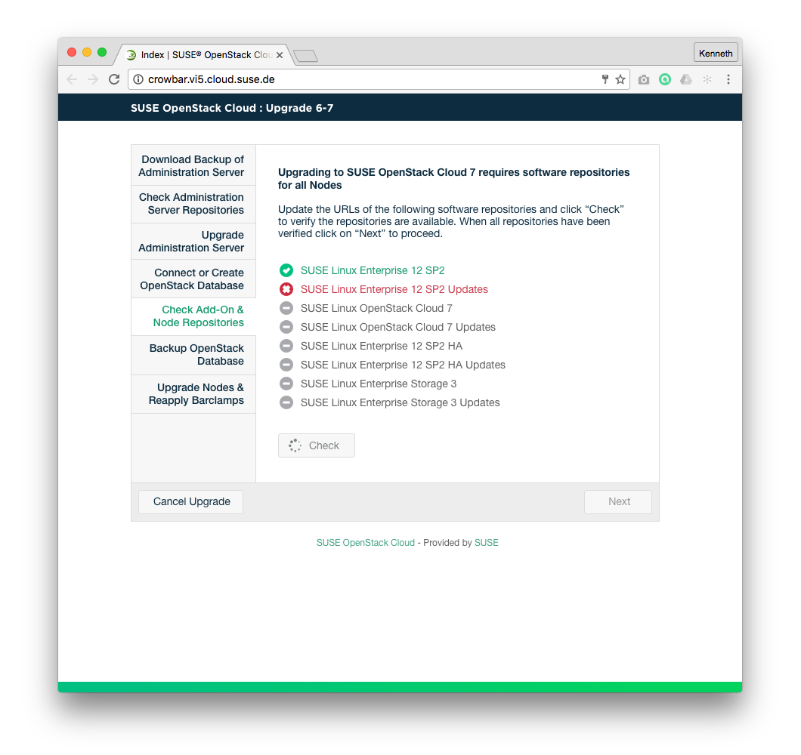

## Wireframes
### Add-On Product Repository Checks Page - Pre Checks State

### Add-On Product Repository Checks Page - Post Checks  State

### High Definition Mockup

### Annotations
| # | Component | Description |
| -------- | -------- | -------- |
| 1   | Add-On Product Repositories Check Section  | Add-On Product Repository informs the user which requirements need to be met before moving forward with the upgrade process |
| 1.1   | Add-On Product Repository Item   | Name of the Add-On Product Repository Item and Status  |
| 1.2   | Check Again button  | This button will be enabled by default and on mouseOver the hover state will be shown. Once the user clicks on it, it will be disabled. A spinner will be displayed if the action takes more than 2 seconds. The button will be enabled if any Add-On Product Repository Item fails.  |
| 2   | Main Control Area  | This area contains the "Next" button which controls the main flow of the wizard.  |
| 2.1   | Next Button  | This button will be disabled by default until the repository checks return success. When enabled, on mouseOver show the hover state. When the user clicks on it, the user will be redirected to [Stop OpenStack Services](Upgrade67-Stop-OpenStack-Services.md).  |
| 3 | Status Section | This section shows the overall status and current step of the upgrade process. |
| 3.1 | Status Item | All steps necessary to upgrade the cloud is displayed here. The current step is displayed to the user. No user interaction is possible. |

## Business Rules
1. Upgrade Add-On Product Repositories Checks page can only be accessed by the Crowbar Administrator.
1. Crowbar Administrator must successfully run  Add-On Products Repository checks only if an AddOn product has been installed.
1. Add-On Product Repositories checks for the Upgrade flow consist on:
  1. If Hight Availability (HA) Add-On is installed, check HA repositories are in place
  1. If Ceph Storage Add-On is installed, check Ceph Storage repositories are in place
1. "Check" button is enabled by default.
1. When clicked, "Check" button is disabled.
1. When clicked, "Check" button will trigger the Add-On Product Repositories checks.
1. "Next" button is disabled by default.
1. "Next" button is enabled when all Add-On Product Repositories checks pass successfully.
1. When clicked, "Next" button will redirect the Crowbar Administrator to [Stop OpenStack Services](Upgrade67-Stop-OpenStack-Services.md).
1. In case of Add-On Product Repositories checks failure, the "Check" button will be enabled.
1. In case of Add-On Product Repositories checks failure, the Crowbar Administrator will be notified.

## Test Cases
### TC.UPGRADE.ADMIN.REPOS.CHECK.01
### TC.UPGRADE.ADMIN.REPOS.CHECK.02
### TC.UPGRADE.ADMIN.REPOS.CHECK.03

## User Stories
- (A list of Trello cards to track the implementation of this page)