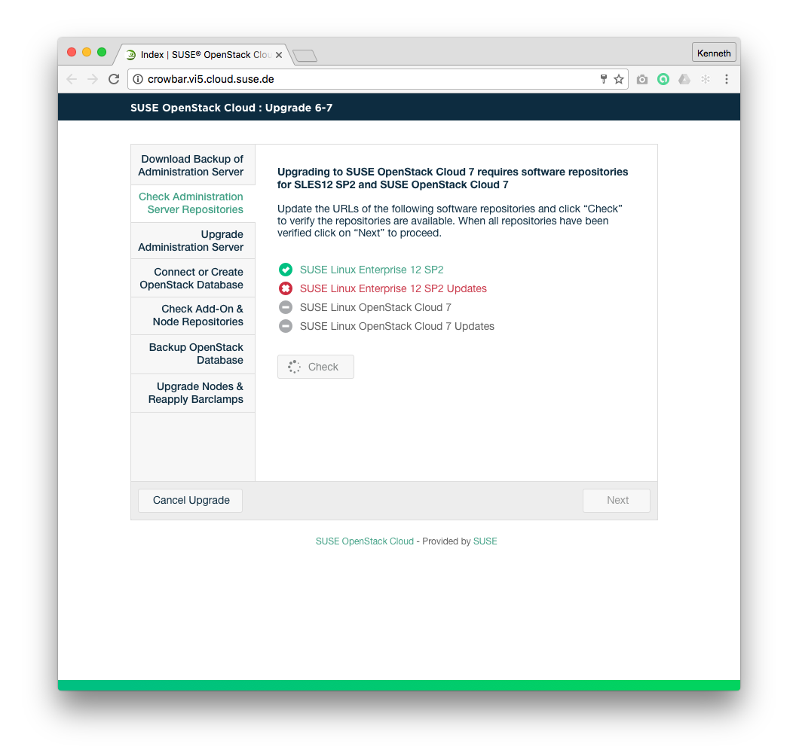

## Wireframes
### Admin Repository Checks Page - Pre Checks State

### Admin Repository Checks Page - Post Checks State

## High Definition Mockup

### Annotations
| # | Component | Description |
| -------- | -------- | -------- |
| 1   | Administration Server Repository Check Section  | This section informs the user what requirements needs to be met before moving forward with the upgrade process. |
| 1.1   | Administration Server Repository Item   | Name of the Administration Server Repository Item and Status.  |
| 1.2   | Check Again Button  | This button will be enabled by default. On mouseOver show the hover state. Once the user clicks on it, it will be disabled. A spinner will be displayed if the action takes more than 2 seconds. When the action is finished the spinner will no longer  be shown. The button will be re-enabled if any repository checks fail.  |
| 2 | Main Control Area  | This area contains the "Next" and "Cancel Upgrade" buttons which control the main flow of the wizard. |
| 2.1   | Cancel Upgrade Button  | This button is always enabled. On mouseOver show the hover state. When clicked, ["Cancel Upgrade" modal window](Upgrade67-Cancel-Upgrade.md) will be displayed |
| 2.2   | Next Button  | This button will be disabled by default until the repository checks return success. When enabled, on mouseOver show the hover state. When the user clicks on it, the user will be redirected to [Upgrade the Administration Server](Upgrade67-Administration-Server.md).  |
| 3 | Status Section | This section shows the overall status and current step of the upgrade process. |
| 3.1 | Status Item | All steps necessary to upgrade the cloud are displayed here. The current step is displayed to the user. No user interaction is possible. |

## Business Rules
1. Upgrade Administration Server Repositories Checks page can only be accessed by the Crowbar Administrator.
1. Crowbar Administrator must successfully run administration server repositories checks.
1. Administration server repositories checks for the Upgrade flow consist on:
  1. SP2 repositories are in place.
  1. Cloud 7 repository is in place.
1. "Check" button is enabled by default.
1. When clicked, "Check" button will be disabled.
1. When clicked, "Check" button triggers the administration server repositories checks.
1. "Check" button will be enabled if any Administration server repositories checks fails.
1. "Next" button is disabled by default.
1. "Next" button is enabled when all administration server repositories checks pass successfully.
1. When clicked, "Next" button redirects the user to [Upgrade Administration Server page](Upgrade67-Administration-Server.md).
1. In case of administration server repositories checks failure, the Crowbar Administrator will be notified
1. The "Cancel Upgrade" button is enabled by default.
1. When clicked, the "Cancel Upgrade" button triggers the ["Cancel Upgrade" modal window](Upgrade67-Cancel-Upgrade.md).

## Test Cases
### TC.UPGRADE.ADMIN.REPOS.CHECK.01
### TC.UPGRADE.ADMIN.REPOS.CHECK.02
### TC.UPGRADE.ADMIN.REPOS.CHECK.03

## User Stories
- (A list of Trello cards to track the implementation of this page)