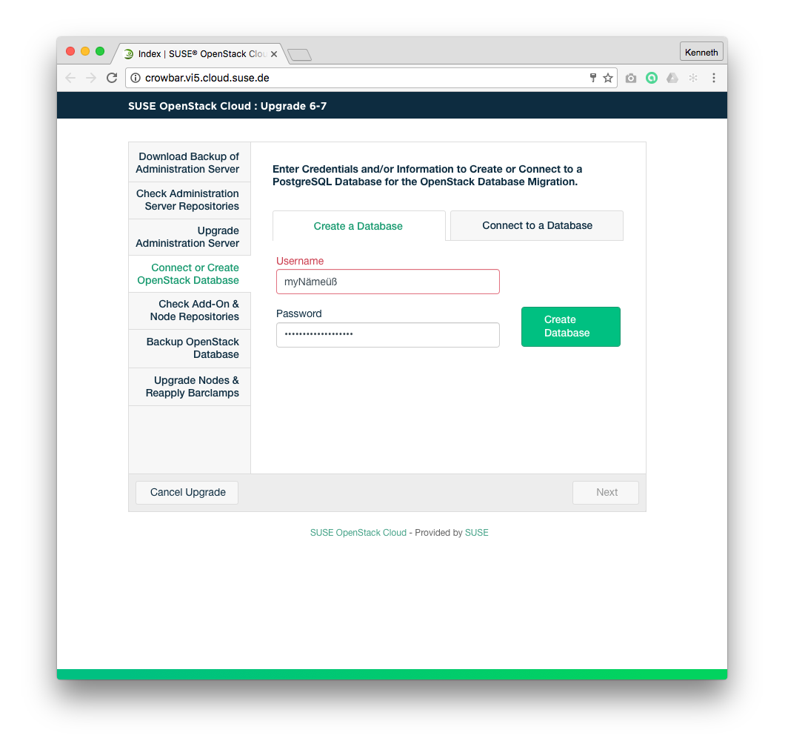

## Wireframes
### Upgrade Database Configuration - Create Database

### Upgrade Database Configuration - Connect to Database

### Upgrade Database Configuration - Connect to Database - Errors

## High Definition Mockups

### Annotations
| # | Component | Description |
| -------- | -------- | -------- |
| 1 | Database Configuration Section | This section contains allows for either the creation of a new database or to connect to an existing database. |
| 1.1   | Create or Connect Tabs  | Offers options to "Create Database" or "Connect to Existing Database". On mouseOver event show a hover state.  |
| 1.2   | Database creation or connection input fields  | Collects the data necessary to either create a database or connect to one. Errors in when testing the connection (see Annotation 1.3 below) will be visually demarcated.   |
| 1.3 | Connect to Database Button | This button connects to the database with the information provided by the user. This button is enabled once the user has entered validated input in all input fields and disabled once clicked, staying disabled if the action is successful. When enabled, on mouseOver show the hover state. On click, the database will be connected using the value entered by the user. If the connection does not succeed the user will be informed. If the connection takes more than 2 seconds a spinner is shown until the action has completed. Once the connection is successful the "Connect to Database" button will be disabled along with all the input fields it contains, and the "Next" button will be enabled. Also, once the "Connect to Database" button is clicked the "Create new Database" tab should be disabled. |
| 1.4 | Create new Database Button | This button creates a new database with the information provided by the user. This button is enabled once the user has entered validated input in all input fields and disabled if the action is successful. On click, the database will be created with the values entered by the user. If the creation takes more than 2 seconds a spinner is shown until the action has completed. When enabled, on mouseOver show the hover state. Once the creation is successful the "Create new Database" button will be disabled along with all the input fields it contains, and the "Next" button will be enabled. Also, once the "Create new Database" button is clicked the "Connect to existing  Database" tab should be disabled. |
| 2   | Main Control Area  | This area contains the "Next" button which controls the main flow of the wizard.  |
| 2.1   | Cancel Upgrade Button  | This button is always enabled although styled differently than other buttons. It cancels the current process and returns the cloud to the state before starting the upgrade.  |
| 2.2   | Next Button  | This button will be disabled by default. When enabled, on mouseOver show the hover state. When creating a new database it will be enabled when the database has been successfully created. When connecting to a database it will be enabled when the database has been successfully connected. When the user clicks on it, the database will be filled with information and the user will be redirected to [Add-On Product Repository Check](Upgrade67-AddOn-Product-Repository-Checks.md). |
| 3 | Status Section | This section shows the overall status and current step of the upgrade process. |
| 3.1 | Status Item | All steps necessary to upgrade the cloud is displayed here. The current step is displayed to the user. No user interaction is possible.

## Business Rules
1. Upgrade Database Configuration page can only be accessed by the Crowbar Administrator.
1. Crowbar Administrator must specify a Postgres database for Crowbar to connect with, either by creating a new one or specifying an existing one.
1. "Create a new Postgres DB" tab will be enabled and selected by default.
1. "Connect to an existing Postgres DB" tab will be enabled and unselected by default.
1. "Create a new Postgres DB" and "Connect to an existing Postgres DB" tabs are mutually exclusive.
1. "Username" field will be displayed on all cases and needs to meet the following restrictions:
    1. Required
    1. Minimum length: 4 characters
    2. Maximum length: 63 characters
    3. Only Alphanumeric characters or underscores are allowed
    4. Must begin with a letter [a-zA-Z] or an underscore
1. "Password" field will be displayed on all cases and needs to meet the following restrictions:
    1. Required
    1. Minimum length: 4 characters
    1. Maximum length: 63 characters
    1. Alphanumeric and special characters are allowed
    1. Must begin with any alphanumeric character or an underscore
1. When "Create a new Postgres DB" tab is selected:
  1. "Create Database" button:
    1. Is displayed.
    1. Is disabled by default.
    1. Is enabled when inline validations are successful.
    1. When clicked, will trigger validations.
    1. When clicked, will be disabled.
    1. Validation errors will be displayed to the user inline in the offending fields.
    1. If validations are successful, will trigger the Database creation.
    1. If any errors in Database creation occurs they will be shown inline in the offending fields.
    1. After validation or creation errors re-enable the "Create new Database" button when the field values are changed in any way.
  1. When the database is successfully created, "Create Database" button, "Connect to existing Database" tab and all input fields will be disabled.
  1. When the database is successfully created, the "Next" button will be enabled.
1. When "Connect to an existing Postgres DB" button is selected:
  1. "Database name" field will be displayed when "Connect to an existing Postgres DB" is selected and needs to meet the following restrictions:
    1. Required
    1. Minimum length: 1 characters
    1. Maximum length: 63 characters (see https://www.postgresql.org/docs/current/static/sql-syntax-lexical.html#SQL-SYNTAX-IDENTIFIERS)
    1. Alphanumeric and special characters are allowed
    1. Must begin with any alphanumeric character or an underscore
  1. "Server" field will be displayed when "Connect to an existing Postgres DB" is selected and needs to meet the following restrictions:
    1. Required
    1. Maximum length: 63 characters (see http://stackoverflow.com/questions/3523028/valid-characters-of-a-hostname)
    1. Numbers and period characters are allowed (only IPv4)
    1. Hostnames are allowed - alphanumeric characters and hyphens (-), cannot start/end with digits or hyphen (see http://stackoverflow.com/questions/3523028/valid-characters-of-a-hostname)
  1. "Port" field will be displayed when "Connect to an existing Postgres DB" is selected and needs to meet the following restrictions:
    1. Required
    1. Minimum length: 1 character
    1. Maximum length: 5 characters
    1. Only numbers are allowed
    1. Default value: 5432
  1. "Connect to Database" button:
    1. Is displayed.
    1. Is enabled once all form fields pass inline validation.
    1. When clicked, will trigger validations.
    1. If validations are successful, will trigger the Database creation with the provided IP/hostname, port number, table prefix, username and password.
    1. If any errors in Database creation occurs they will be shown inline in the offending fields.
    1. After validation or creation errors re-enable the "Create new Database" button when the field values are changed in any way.
  1. If the database connection is successfully made, "Create new Database" button, "Create new Database" tab and all input fields will be disabled
  1. If the database connection is successfully made, the "Next" button will be enabled.
1. "Next" button is disabled by default.
1. When clicked, "Next" button will redirect the Crowbar Administrator to [Add-On Product Repository Check](Upgrade67-AddOn-Product-Repository-Checks.md).

## Test Cases
### TC.UPGRADE.DATABASE.NEW.01
### TC.UPGRADE.DATABASE.EXISTING.01

## User Stories
- (A list of Trello cards to track the implementation of this page)