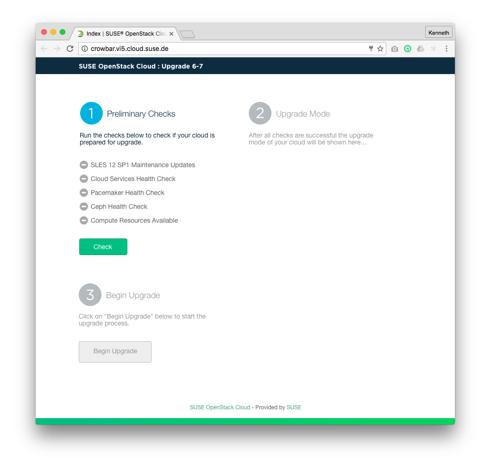

## Wireframe
### Landing Page - Preliminary Checks

### High Definition Mockup

## Annotations
| # | Component | Description |
| --- | -------- | -------- |
| 1   | Preliminary Check Section  | Contains information, a status list of the preliminary checks, and a "Check" button. This section should "float left". |
| 1.1   | Preliminary Check Item   | Name of the Preliminary Check and it status.  |
| 1.2   | Check Button  | Enabled by default, on mouseOver show the hover state and once the user clicks this button, it will be disabled and a spinner will be displayed if the action takes more than 2 seconds. This button will be re-enabled if any preliminary check failed.  |
| 2   | Upgrade Mode Section  | Contains generic information, and, once all checks have passed upgrade mode specific information. In case of normal mode, the "proceed in normal mode" button is shown and enabled once the checks have passed. In case of non-disruptive mode only information is shown. This section should "float left". |
| 2.1   | Proceed in Normal Mode Button  | This button is just for confirmation. Once clicked the "Begin Upgrade" button will be enabled. |
| 3   | Begin Upgrade Section  | Contains information the "Begin Upgrade" button as well as information about it. This section should "float left". |
| 3.1   | Begin Upgrade Button   | This button will be enabled when the preliminary checks all return success, and in case of normal mode, the "proceed in normal mode" button has been clicked. On mouseOver show the hover state. When clicked, the [Backup Administration Server page](Upgrade67-Backup-Administration-Server.md) will be displayed.  |

## Business Rules
1. Upgrade process flow can only be accessed by the Crowbar Administrator.
1. Crowbar Administrator must successfully run preliminary checks.
1. Preliminary checks for the Upgrade flow consist of:
  1. All maintenance updates available have been successfully installed.
  1. Crowbar sanity network checks (6 different network checks)
  1. If High Availability module is available, its health check pass
  1. There is a free node as large as the largest running node
1. "Check" button is enabled by default.
1. "Check" button is enabled but set to a secondary button when all preliminary checks are successful and the Upgrade Mode section is enabled.
1. Depending upon the determined upgrade mode the one of two things happens
  1. Normal Mode: information about normal mode and a "proceed with in normal mode" button is displayed when all checks succeed
  1. Non-Disruptive Mode: information about non-disruptive mode is shown and "Begin Upgrade" section and button is enabled when all checks succeed.
1. "Begin Upgrade" button changes the status of the nodes to "upgrade".
1. When clicked, "Begin Upgrade" button redirects the user to [Backup the Administration Server page](Upgrade67-Backup-Administration-Server.md).
1. In case of preliminary checks failure, the Crowbar Administrator is notified.
1. In case of preliminary checks failure, the Crowbar Administrator is able to trigger a new check.
1. In case of failure when setting the upgrade node-state button:
  1. The upgrade nodes-state is reverted.
  1. The user is notified. 
  1. The Crowbar Administrator remains on the current Landing page.
1. The current repository information will be retrieved and stored in case of cancelling upgrade.

## Test Cases
### TC.UPGRADE.LANDING.01
1. Given I am Crowbar Administrator
2. And I have a SUSE OpenStack Cloud 6
3. And I have all maintenance updates installed
4. And I have a healthy High Availability module
5. And I have a healthy network on Crowbar
0. And I have a free node as large as the largest running node
6. And I navigate to the Upgrade Flow
7. And I see Begin Upgrade button disabled
8. When I click on Run Checks button
9. Then I will not see error messages
10. And I will see Begin Upgrade button enabled

### TC.UPGRADE.LANDING.02
### TC.UPGRADE.LANDING.03

## User Stories
- (A list of Trello cards to track the implementation of this page)